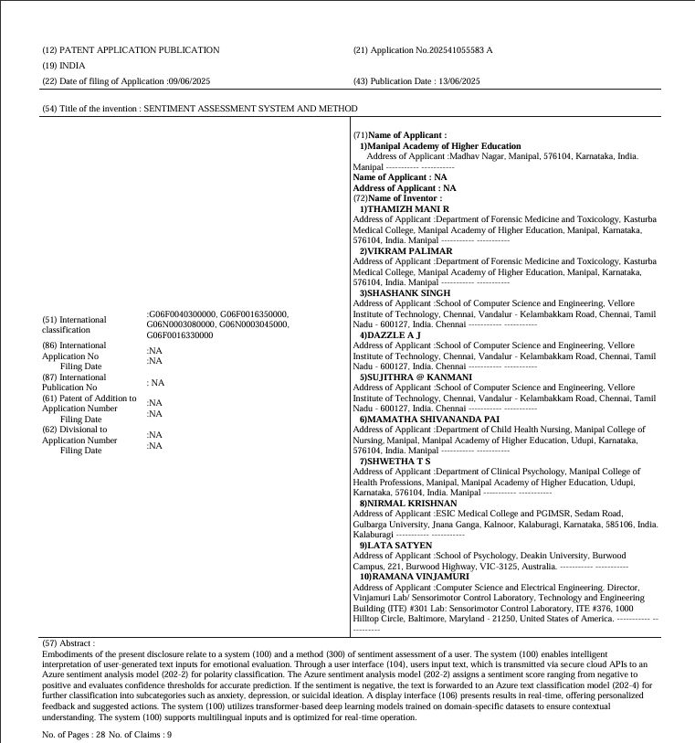
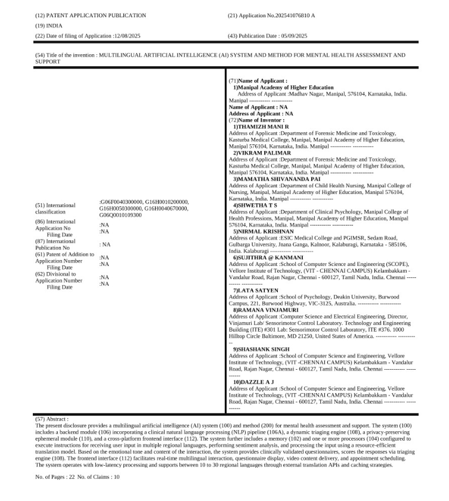
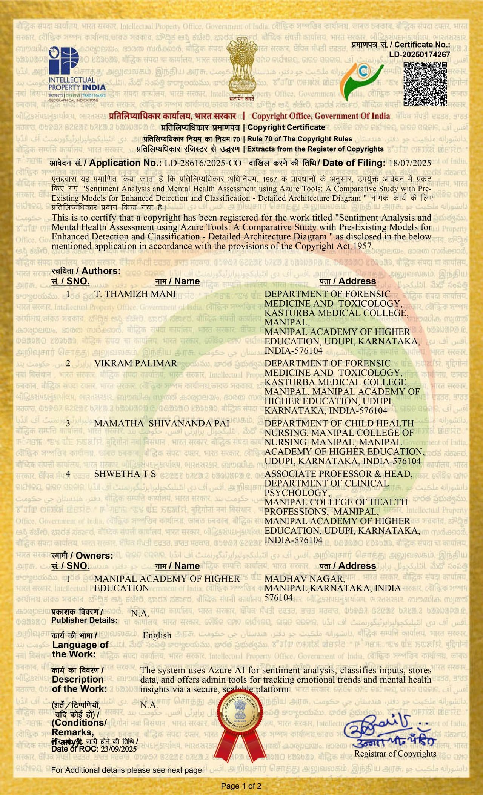
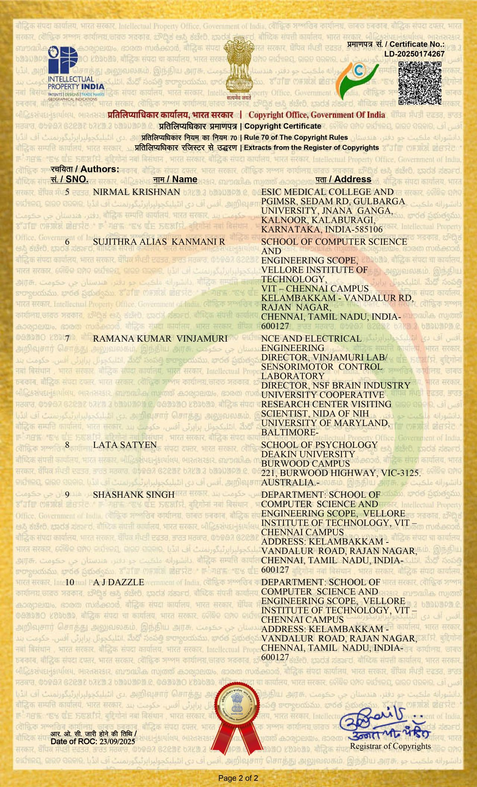
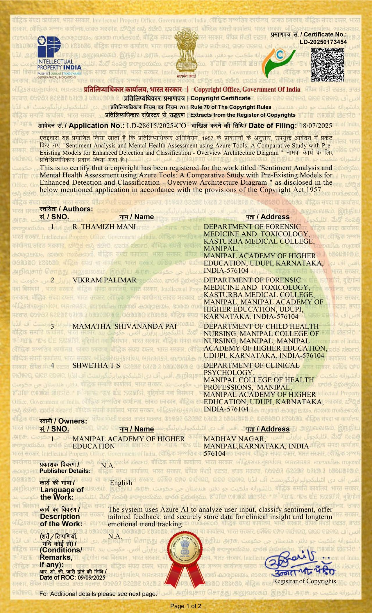
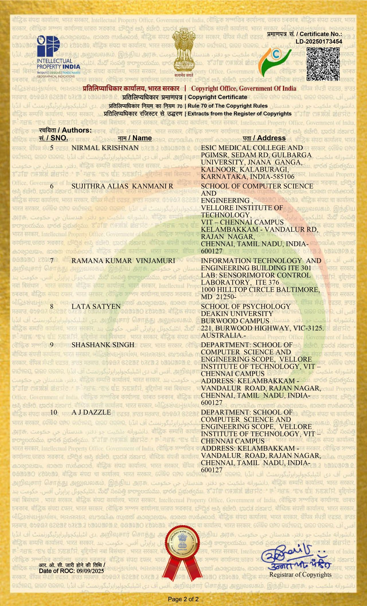

# 🧠 MIND - Multilingual AI System for Mental Health Assessment & Support

A clinically grounded, AI-powered Android application designed to democratize access to mental health support. This system utilizes a **transformer-based deep learning architecture** and **Azure NLP services** to interpret user sentiment in real-time. It employs a novel hierarchical classification method to distinguish between general emotional states and critical clinical markers—such as anxiety, depression, and suicidal ideation—across a plurality of regional languages.

---

## 📥 Download App

Get the latest stable version of the application directly.

> *Note: If the download does not start automatically, please view the file in the [repository source](https://github.com/ShashankS1011/MIND/blob/main/MIND_v1.0_debug.apk) and click "Download".*

---

## 📜 Intellectual Property: Patents

This technology is protected under Indian Patent laws. The core methods for sentiment assessment and multilingual processing have been officially published.

| Document | Application No. | Publication Date | Status |
| :--- | :--- | :--- | :--- |
| **Sentiment Assessment System and Method** | 202541055583 A | 13/06/2025 | **Published** |
| **Multilingual AI System for Mental Health** | 202541076810 A | 05/09/2025 | **Published** |

  
  

---

## ©️ Copyrighted Architecture & Designs

The specific architectural logic, data flow pathways, and system layouts presented below are registered works under the **Copyright Office, Government of India**. These diagrams define the unique intellectual property of the MIND system.

### 1. Detailed System Architecture
**Registration No:** `LD-28616/2025-CO` | **Date:** 23/09/2025

This work illustrates the granular component interactions within the system, including the **Secure API Gateway**, **Ephemeral Processing Module**, and the **Database Synchronization Logic**. It legally defines how user data transitions from the frontend interface to the cloud inference engine while maintaining privacy compliance.

  
  

### 2. Overview Architecture Diagram
**Registration No:** `LD-28615/2025-CO` | **Date:** 09/09/2025

This work encompasses the high-level macro-architecture, defining the relationship between the **Android Client (User Device)**, the **Firebase Realtime Backend**, and the **Azure Cognitive Services**. It protects the unique "Two-Tier" methodology used to route requests based on preliminary sentiment scoring.

  
  

---

## 🔬 Scientific Methodology

As detailed in patent applications **202541055583 A** and **202541076810 A**, the system operates on a sophisticated **"Two-Tier" Clinical NLP Pipeline (106A)** designed to filter, analyze, and triage user emotional states with high precision.

### 1. Latency-Aware Multilingual Processing
The system is architected to support **10 to 30 regional languages** dynamically.
* **Input Normalization:** Raw text inputs via the secure interface (104) undergo tokenization and normalization.
* **Smart Translation Caching:** To minimize API latency, the system utilizes a heuristic caching mechanism for frequently occurring phrases, reducing the reliance on real-time external translation services for common expressions.

### 2. Tier-1: Polarity Classification
The first layer of analysis utilizes an **Azure Sentiment Analysis Model (202-2)** for immediate emotional baselining.
* **Confidence Scoring:** The model assigns a confidence score (0.0 - 1.0) to the input.
* **Outcome:** Inputs are classified into **Positive**, **Neutral**, or **Negative**.
* *Optimization:* Positive and Neutral inputs trigger immediate reinforcement loops, bypassing the computationally expensive clinical tier to optimize resource allocation.

### 3. Tier-2: Clinical Sub-Classification
Inputs flagged as **Negative** with high confidence are routed to a custom-trained **Azure Text Classification Model (202-4)**. This model is fine-tuned on clinical datasets to perform multi-label classification, distinguishing between:
* **Anxiety Markers**
* **Depressive Symptoms**
* **Suicidal Ideation / Crisis Signals**

### 4. Dynamic Triaging Engine (108)
The core logic resides in the Triaging Engine, which synthesizes the classification outputs to determine the intervention pathway:
* **Low Severity:** Delivers automated, clinically validated questionnaires or therapeutic video content.
* **High Severity:** Activates "Red Flag" protocols, recommending immediate professional consultation.
* **Nuance Detection:** The engine includes sub-routines for **Sarcasm Detection** and **Emoji Interpretation**, preventing false positives in mixed-context user statements.

### 5. Privacy-Preserving Ephemeral Architecture
To comply with medical data standards, the system incorporates an **Ephemeral Module (110)**. This ensures that sensitive triage data used for real-time inference is processed in memory and is not persistently stored in the raw format, ensuring user anonymity and data security.

---

## ⚖️ Disclaimer

**Medical Disclaimer:** This AI system is designed for **assessment, support, and screening purposes only**. It does not constitute a professional medical diagnosis. In instances of severe distress, self-harm, or emergency, users are strictly advised to contact local emergency services or a certified medical professional immediately.

---
